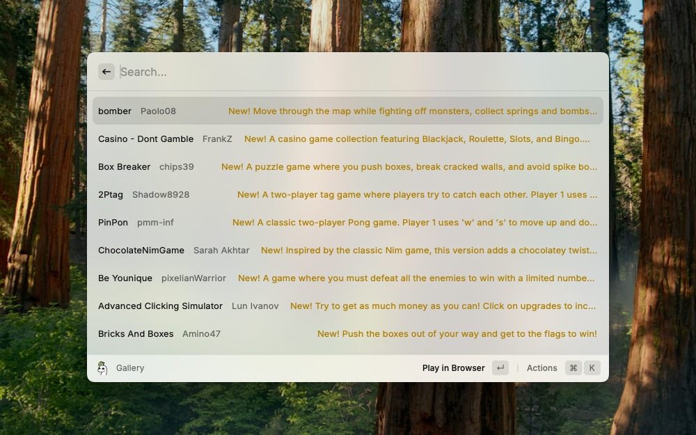

# Sprig Gallery

https://github.com/user-attachments/assets/cb5d74a3-22f9-40cc-b6f3-d8689aa9b0ca



Sprig Gallery is a extension for Sprig (an project from [Hack Club](https://hackclub.com/), an nonprofit) that lets you see all the projects in the [Sprig gallery](https://sprig.hackclub.com/gallery).
You can open the games, remix it (aka fork it) and copy the link!

## How to search
You can put the name of the game, author or the tag (example: 1:bomber 2:lucas11 3:platformer)

## How to install
Run this in your terminal:
```
npm install && npm run dev
```
Now its installed! But you need to have the npm run dev when you use it.
